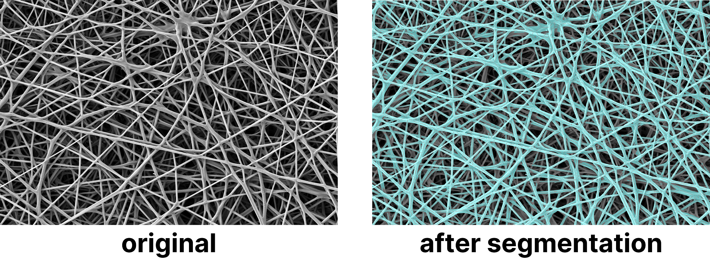

# fibresem

A small python repo to analyse SEM images of fibrous materials. The repo can also be used to annotate SEM images that have been taken with the Zeiss Auriga.

## Requirements

The diameter analysis requires the [MATLAB® Engine API for Python](https://mathworks.com/help/matlab/matlab-engine-for-python.html). Since this repository is written in Python 3.9, this requires **MATLAB® 2021b** or newer.

## Installation

Install the python fibresem module in a virtual environment `env`:

    $ py -m venv env
    $ pip install fibresem

The module can now be run within the environment `env` as follows:

    $ ./env/Scripts/activate
    (env) $ py -m fibresem

To use the fibre diameter analysis, install the MATLAB® Engine API for Python as follows:

    $ cd {matlabroot}/extern/engines/python
    $ python setup.py build --build-base=$HOME/tmp/build install --user

Remove ``--user`` flag for installation within environment.

## Usage

    python -m fibresem [OPTIONS] INPUT_PATH COMMAND1 [ARGS] [COMMAND2 [ARGS]] ...

The following options can be used for `[OPTIONS]`:
* ``-v, --verbose``
* ``--help``

The commands can be chained. The following commands can be used for `[COMMAND1]`, `[COMMAND2]`, `...`.
* ``crop``    Crop and annotate .tif files and export to png. See [Annotating](#annotating).
* ``diam``    Perform diameter analysis. See [Diameter analysis](#diameter-analysis).
* ``rename``  Auto rename files. See [Auto-renaming](#auto-renaming).

E.g.:

    python -m fibresem C:\testfiles\ rename overview.txt crop diam --thick-opt

To get help for a specific command, e.g. ``diam``, use:

    fibresem diam --help

### Annotating

Cropping and annotating can be done with the ``crop`` command.

    py -m fibresem INPUT_PATH crop

* Crops .tif file, removes SEM Bar
* Adds scalebar based on Pixel Size
* Adds sample name
* Saves the image as a .png image in a separate ``/output/`` folder.

### Diameter analysis

Diameter analysis can be done with ``diam`` command using the Simpoly algorithm developed by Murphy et al.[[1]](#1) Requires MATLAB.

    py -m fibresem INPUT_PATH diam [options]

Additional options:

* ``--thick-opt/--no-thick-opt`` default: false

### Auto-renaming

    py -m fibresem INPUT_PATH rename OVERVIEW_FILE

The ``OVERVIEW_FILE`` should have a structure similar to the following:

    img	dish	pos	width	remarks	sample
    1	1	2	20	-	PU.088
    2	1	2	100	-	PU.088
    3	1	2	200	-	PU.088

## Sample Data

Two sample images are provided in `/sampledata`. To run FibreSem with the sample data, activate the virtual environment. Navigate to the folder containing the sample data or copy the sample data path. (Remember to use double quotes, when the sample data path contains spaces.)

    $ ./env/Scripts/activate
    (env) $ cd [path to sample data]
    (env) $ py -m fibresem -v ./ crop diam --no-thick-opt

The verbose output should be as follows:

    [14:56:56] Adding images.
    - Input Path: C:\dev\python\sem\fibresem\sampledata
    -- sample.01_img08.tif
    -- sample.02_img20.tif
    [14:56:56] Running command 1 of 2
    [14:56:56] Running annotate script on 2 images.
    [14:56:56] Annotating sample.01_img08.tif
    [14:56:56] -- Cropping
    [14:56:56] -- Adding scalebar, pixelsize = 9.766 nm
    [14:56:56] -- Adding sample name
    [14:56:56] -- Writing output to: sample.01_img08.png
    [14:56:57] -- Output written
    ...
    [14:56:58] Running command 2 of 2
    [14:56:58] Running script: diameter_analysis
    [14:56:58] Engine Handler not defined.
    [14:56:58] Matlab module loaded.
    [14:56:58] Starting Matlab Engine ...
    [14:57:01] Starting diameter analysis.
    [14:57:01] Diameter analysis parameter 'optimise_for_thin_fibres' = True
    [14:57:01] Analyzing 01 of 2: sample.01_img08.tif
    Loading image in MATLAB
    Enhance contrast
    Erode Grayscale
    Morphological Reconstruction
    ...
    sample.01_img08.tif:    avgp: 8.570 px     sdevp: 1.786 px   avg: 0.084 µm   sdev: 0.017 µm 
    sample.02_img20.tif:    avgp: 11.949 px    sdevp: 3.125 px   avg: 0.583 µm   sdev: 0.153 µm 
    [14:57:16] Exporting analysis to C:\dev\python\sem\fibresem\sampledata\export.xlsx
    [14:57:17] Successfully exported.
    [14:57:17] Saved .mat file
    [14:57:17] Process exited.

## To-Dos:

* `(30%)` Port SIMPoly to pure Python code
* `( 0%)` Add automatic quality of analysis indicator.

## References
<a id="1">[1]</a> 
Murphy, R., Turcott, A., Banuelos, L., Dowey, E., Goodwin, B., & Cardinal, K. O. (2020). SIMPoly: A Matlab-Based Image Analysis Tool to Measure Electrospun Polymer Scaffold Fiber Diameter. Tissue engineering. Part C, Methods, 26(12), 628–636. https://doi.org/10.1089/ten.TEC.2020.0304